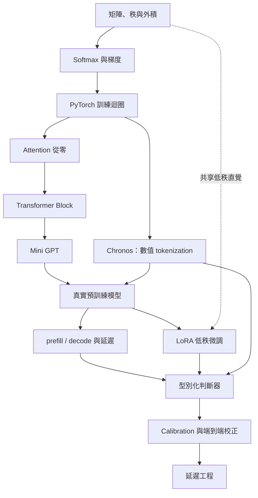

# LLM 概念打通：18 週育嬰假課程（v3 · 整合 Chronos）

> **目標**：理解，不是產出作品集。
> 從矩陣乘法一路打通到「為什麼判斷任務可以做到毫秒級」。
>
> **適用**：具備 DevOps / 雲端 / Kubernetes / 系統設計經驗，正在補齊深度學習與 LLM 內部機制。
>
> **時程**：16 週內容 + 2 週緩衝 = 18 週。進度滑掉是常態，緩衝已內建。

---

## 一、這條路的核心洞見

先講終點，因為知道要去哪，每週在幹嘛就很清楚。

**毫秒級判斷的關鍵不在模型小，而在省掉逐 token 的自迴歸生成。**

- 生成 100 個 token，需要依序跑約 100 個 decode step。有 KV Cache 不必重算歷史 K/V，但相依的 token 無法一次平行產出。
- 分類式判斷通常在 **1 次 prefill / forward** 之後，靠 classification head 或候選 logits 就得到結果。

省掉 decode 這一段，延遲可能下降一到兩個數量級。

### 同一個動作，兩種 head

這門課的收尾論點是：**Chronos-2 和 System One 做的是同一件事。**

| | 輸入 | 輸出 | 架構 |
|---|---|---|---|
| **Chronos-2** | 時間序列（含多變量與 covariate） | 未來多步的 quantile 分布 | Encoder-only，一次 forward |
| **System One / Jev** | 狀態 + 型別化問題 | Choice / Score / Boolean 的機率 | 未公開 |

兩者都放掉自迴歸生成，一次 forward 直接輸出一個分布。差別只在輸出的**型別**：一個是連續值的分位數，一個是離散選項的機率。

所以整條路徑的終點是：

> **如何把預訓練模型改造成「一次 forward 就輸出經過校正之機率」的判斷器 —— 不論輸出是連續分布還是型別化選項。**

拆成四件事：

| 問題 | 對應內容 |
|---|---|
| 這個 forward pass 裡面在算什麼 | Attention 與 Transformer Block（矩陣數學） |
| 為什麼 tokenization 不是文字專屬 | Chronos 的 scaling + quantization |
| 如何用較少的可訓練參數適應任務 | LoRA（低秩更新） |
| 如何讓輸出成為可驗證的機率 | Calibration + 獨立測試集 + **端到端校正** |

### ⚠️ 四個要記住的界線

**一、「毫秒級」是要實測的目標，不是架構自動保證。** 實際延遲取決於模型大小、輸入長度、硬體、量化、batch 與服務開銷。W10 和 W15 的重點就是自己量出來，不要接受任何預設數字，包括這份文件裡的。

**二、本課程只借鑑 System One 的介面設計，不宣稱重製 Jev。** Jev 的模型架構、訓練細節與權重都沒有公開，速度與成本數字目前也只有 TypeSafe 自己的測試。「從既有模型改造成判斷器」是**我們用來學習這個介面的工程路線**，不代表 Jev 本身是這樣做的。
參考：[System One 官方文件](https://docs.typesafe.ai/introduction)

**三、預測不等於決策。** Chronos 給你一個機率分布，不給你「該不該做」。門檻、冷卻時間、人工核准這些留在確定性的規則層，不要讓模型決定。

**四、Chronos 在金融序列上的零樣本表現通常很弱。** 它贏的 benchmark（fev-bench、GIFT-Eval、Chronos Benchmark II）是通用時序資料集，不是市場。金融序列接近隨機漫步，任何模型的優勢都很薄。本課程用**雲端維運 metrics** 當主場景，交易只當第二個資料集。

> **另一個提醒**：網路上有論文宣稱 Chronos-2 的核心創新是 MoE，這與 Amazon 官方與 HF model card 的描述不符 —— 官方講的是 encoder-only + group attention。看到那個說法不要被帶偏。

### LoRA 與 Week 1 的關係（不要搞錯）

`W' = W + (α/r)BA` — 凍結原權重 `W`，只訓練兩個較小矩陣 `A`、`B`。

**LoRA 並不是對 `W` 做 SVD。** 它學的是一個低秩的**更新量** `ΔW = BA`，主張是「適應任務所需的更新具有低內在秩」，不是「權重本身低秩」。

Week 1 的 SVD 練習是用來建立「資訊可能集中在少數方向」這個直覺，第十一週再把同一個直覺用到可訓練的低秩更新上。**共享數學直覺，不是同一個演算法。**

---

## 二、課程設定

- **期間**：18 週（16 週內容 + W8 後、W12 後各一週緩衝）
- **每週投入**：6～8 小時，切成 **25 分鐘的碎片**
- **最低可行**：每週 3 小時，只做「動手」那一項
- **硬體**：Apple Silicon 64GB 足夠跑完全部核心內容（Chronos-2 支援 CPU 推論）
- **語言**：Python，PyTorch

### 每週的固定結構

1. **目的** — 這週要解決什麼困惑
2. **必懂** — 兩到三個觀念，不貪多
3. **動手** — 一件事，做完就算數
4. **要能答** — 一個問題，答不出來就是沒懂

### 真正的交付物

**不是程式，是每週一段自己寫的白話解釋。**

判斷懂了沒的標準：能不能用**沒有公式的白話**講清楚。能寫出 attention 的公式不算懂，能解釋「為什麼要除 √d_k」才算。

這些解釋現在只是筆記，不用潤飾。它們是後面收成技術文章的原料。

### 育嬰期間的原則

1. 每次 25 分鐘，不依賴連續三小時的空檔
2. 每週只鎖一個「動手」項目，完成才做延伸
3. 不追求把數學全部重念，只補當週用得到的部分
4. AI 可以協助寫程式，但你必須能說明輸入、輸出、Shape、Loss
5. 卡住就先跳過，後面用到再回來

---

## 三、能力地圖



---

## 四、課表總覽

| 週次 | 主題 | 動手產出 |
|---:|---|---|
| 1 | 矩陣、Shape 與秩 | 手寫矩陣乘法 + SVD 低秩還原 |
| 2 | Logit、Softmax 與 Cross Entropy | Stable Softmax + Temperature 分布圖 |
| 3 | 梯度與反向傳播 | 純 Python 微型 Autograd |
| 4 | PyTorch 與訓練迴圈 | 二元分類器，存檔再載回 |
| 5 | Tokenization：文字與數值 | Tokenizer 觀察 + 手寫 Chronos 式量化 |
| 6 | Attention 從零 | 純 Python 版與 PyTorch 版比對 |
| 7 | Transformer Block | 完整 Block + Mask 測試 |
| 8 | 位置編碼與 Mini GPT | 字元級模型，能生成文字 |
| — | **緩衝週 + 第一驗收點** | 補缺口，不開新進度 |
| 9 | 兩種真實模型 | Decoder-only 與 Chronos-2 架構對照 |
| 10 | 為什麼生成慢 ⭐ | Chronos v1 vs v2 的延遲實測 |
| 11 | LoRA 的數學 | 手寫 `LoRALinear` + Merge 驗證 |
| 12 | 真的微調一次 | 用 PEFT 訓練一個 Adapter |
| — | **緩衝週 + 第二驗收點**（選修：架構 B） | 共享 backbone 實驗 |
| 13 | 型別化判斷器 | Chronos → 決策的完整管線 |
| 14 | Calibration 與端到端校正 ⭐ | Coverage + 決策層 ECE |
| 15 | 延遲工程 | 延遲對照表 + 一次雲端 GPU 實測 |
| 16 | 收束 | 一份自己的完整說明文件 |

⭐ 這兩週決定你有沒有真的懂。其他週卡住可以跳，這兩週不要跳。

---

## 五、主場景：EKS 容量與異常決策

整份課程的實作都圍繞同一個場景，這樣每週的產出可以累積。

```
輸入：多變量 metrics 時序
  CPU utilization / memory / storage IO / request latency / error rate
  covariate：部署事件、時段、已知流量活動

    ↓  Chronos-2 多變量預測（這正是 v2 新增的能力）

預測：未來 H 步的 quantile 分布

    ↓  型別化決策 head

決策：
  severity:            P1 / P2 / P3 / P4
  action:              scale_up / investigate / hold
  evidence_sufficient: probability
  confidence:          每項的機率

    ↓  確定性規則層（不交給模型）

執行：門檻、冷卻時間、最大擴容幅度、人工核准
```

**為什麼是這個場景**：Amazon 自己就拿雲端維運當 Chronos-2 的示範 —— 同時預測 CPU、記憶體與儲存 I/O 來提前預判資源瓶頸。資料可以完全合成、不碰公司內容。而且你的維運直覺可以判斷合成出來的東西像不像真的。

**資料紀律**：所有案例自行設計或用公開資料。不放入公司 metrics、客戶資訊、憑證、網路拓樸或受 NDA 保護的內容。

---

## 六、階段一：數學地基（W1–W3）

> 你的微積分和線代底子還在，這三週是**喚醒不是重學**。

### Week 1 · 矩陣、Shape 與秩

**目的**：建立 shape 直覺，並提前埋下 LoRA 的低秩伏筆。

**必懂**
- 矩陣乘法為什麼是 `(m,n) @ (n,p) = (m,p)`
- 轉置、batch 維度
- **矩陣的秩**
- **外積 `u @ vᵀ` 產生 rank-1 矩陣**

**動手**
- 不用 NumPy，手寫向量內積與二維矩陣乘法，每步印 shape
- 用 NumPy 對一張圖做 SVD，壓成 rank-10 再還原，看還剩多少資訊

**要能答**
> 在什麼條件下，rank-10 近似可以留住大部分資訊？如何從奇異值的分布判斷？

這題建立的是 LoRA 所需的低秩直覺，不是 LoRA 有效性的證明。

---

### Week 2 · logit、Softmax 與 Cross Entropy

**必懂**
- logit 不是機率
- Stable Softmax 為什麼要先減最大值
- Cross Entropy 就是 `-log(正確答案的機率)`
- **Temperature 對分布的影響**

**動手**
```python
def stable_softmax(scores):
    maximum = max(scores)
    exp_scores = [math.exp(s - maximum) for s in scores]
    total = sum(exp_scores)
    return [s / total for s in exp_scores]
```
- 測試極大輸入不會 overflow
- 同一組 logits 用 `T=0.5 / 1 / 2` 畫出分布變化
- 比較 `[0.74, 0.18]` 與 `[7.4, 1.8]` 的 softmax 結果

**要能答**
> 溫度調高調低，數學上到底在動什麼？

---

### Week 3 · 梯度與反向傳播

**必懂**
- 導數是局部斜率、Chain Rule
- 計算圖、Forward Pass / Backward Pass
- Gradient Descent 與 Learning Rate

**只需要複習**：`x²`、`exp(x)`、`log(x)` 的導數、Chain Rule、偏微分。不用重讀整本微積分。

**動手**
- 純 Python 寫一個 20 行的 micrograd：`Value` 類別，支援 `+`、`*`、`tanh`，跑通一次 backward
- 畫出 `y = (x*w + b)²` 的計算圖，手算一次梯度

**要能答**
> 一個權重的梯度，是怎麼從最後的 loss 傳回來的？

---

## 七、階段二：從零蓋一個 Transformer（W4–W8）

### Week 4 · PyTorch 與訓練迴圈

**必懂**
- `Tensor`、`dtype`、`device`（Apple Silicon 用 `mps`）
- `requires_grad`、`nn.Module`
- Optimizer、batch vs epoch vs step

**動手**
- 訓一個二元分類器，完整跑通 training loop
- 儲存權重再載回來，確認結果一致

**要能答**
> `loss.backward()` 和 `optimizer.step()` 各做了什麼？

**教材**：[PyTorch Learn the Basics](https://docs.pytorch.org/tutorials/beginner/basics/intro.html)

---

### Week 5 · Tokenization：文字與數值 🔗

**目的**：理解 transformer 那套機器是領域無關的，換的只是 tokenizer。

**必懂 A：文字**
- BPE tokenizer 在做什麼
- Embedding table 就是一張查表矩陣
- `(batch, seq_len, d_model)` 這個 shape 之後會一路跟著你

**必懂 B：數值（Chronos v1 的做法）**
- Chronos 幾乎照抄 LLM 架構，主要差別只在 tokenization 從文字換成處理連續值的時間序列
- **兩步驟**：先 scaling（處理不同序列間量級差異太大的問題），再 quantization（把連續實數分箱成離散 token）
- 之後就用 T5 當骨幹，**把預測當成語言模型任務**，用 cross entropy 訓練
- **代價**：量化會損失數值精度

**動手**
- 用 `tiktoken` 或 HF tokenizer 切一句中文和一句英文，比較 token 數
- **手寫一個 Chronos 式的量化器**：給定一段時序，做 mean scaling，再分成 N 個 bin，輸出 token id 序列；寫反量化函式，觀察還原誤差
- 試不同 bin 數，看精度與詞彙表大小的取捨

**要能答**
> 為什麼中文通常比英文吃更多 token？
>
> 把連續值量化成 token，損失了什麼？換到了什麼？

---

### Week 6 · Attention 從零

**必懂**
- Q、K、V 各自的角色
- `QKᵀ / √d_k`，以及**為什麼要除 √d_k**
- Softmax 在哪一個維度執行
- Mask、Weighted Sum

**動手**
- 純 Python 版與 PyTorch 版各寫一次，比對數值一致
- 每一步印 shape

**要能答**
> `Q @ K.T` 出來的矩陣，每一格代表什麼？

---

### Week 7 · Transformer Block

**必懂**
- Multi-Head 是怎麼「切」出來的
- Feed-Forward Network
- Residual 為什麼能讓深層訓得起來
- LayerNorm vs RMSNorm
- Causal Mask
- **Encoder-only / Decoder-only / Encoder-decoder 三種配置的差別**，以及 mask 設計如何跟著任務走

**動手**
- 實作一個完整 `TransformerBlock`，每個 tensor 加 shape 註解
- 寫測試確認 mask 後看不到未來位置
- 把同一個 block 改成雙向（拿掉 causal mask），觀察差異

**要能答**
> 為什麼 multi-head 比 single-head 好？它不是只是把維度切小嗎？
>
> 什麼任務適合 encoder-only？什麼任務非要 causal mask 不可？

---

### Week 8 · 位置編碼與 Mini GPT

**必懂**
- 為什麼 attention 本身沒有順序概念
- 絕對位置編碼 vs **RoPE（旋轉的直覺）**
- Language Modeling Loss
- Autoregressive 生成、Temperature、Top-K

**動手**
- 把 W6–W7 組起來，訓一個字元級小模型，讓它生成文字
- 存 loss 曲線，比較不同 temperature 的輸出

**語料**：用授權清楚的真實文本 —— 自己的 Markdown 筆記、Public Domain 語料、允許再利用的資料都行。LLM 生成的文字分布偏窄、容易出現重複樣式，若要用就跟真實資料分開評估。

**要能答**
> RoPE 是怎麼把「相對位置」變成一個旋轉矩陣的？

---

### 🔹 第一驗收點（W8 後，含緩衝週）

> 能不能在白板上不看筆記，畫出一個 transformer block 的資料流並標出所有 shape？

做得到，前半段結束。做不到，用緩衝週補。

---

## 八、階段三：真實模型與 LoRA（W9–W12）

### Week 9 · 兩種真實模型 🔗

**目的**：確認你寫的核心積木如何對應到真實模型 —— 以及兩種架構選擇如何跟著任務走。

**必懂 A：Decoder-only LLM**
- 真實模型和 W7 共享核心積木，但還會用到 RoPE、RMSNorm、SwiGLU、**GQA/MQA**、不同 bias 設計等工程最佳化

> **GQA 會讓你困惑**：印 shape 時會發現 `k_proj`、`v_proj` 比 `q_proj` 小好幾倍。那不是你載錯模型，是多個 query head 共用一組 key/value head。先知道這件事存在，省掉一個晚上。

**必懂 B：Chronos-2**
- **120M 參數、encoder-only** 的時序基礎模型，受 T5 encoder 啟發
- 單一架構同時支援 univariate、multivariate 與 covariate-informed 任務
- 直接產出**多步 quantile 預測**
- 用 **group attention** 在相關序列與 covariate 之間做 in-context learning
- 訓練資料混合真實資料與大規模合成資料
- 支援 GPU 與 CPU 推論

**動手**
- 載一個 0.5B～1.5B 的 decoder-only 小模型，印出所有層名稱與 shape，找出 `q_proj`、`k_proj`、`v_proj`、`o_proj`
- 載 `amazon/chronos-2`，同樣印一次
- **做一張架構對照表**：有無 decoder、mask 型態、輸出 head 形狀、參數量、attention 變體
- 下載前確認 Model Card 與 License

**要能答**
> 這兩個模型的參數量，各自怎麼從 shape 加出來？
>
> Chronos-2 為什麼可以是 encoder-only？它捨棄了什麼能力？

---

### Week 10 · 為什麼生成慢 ⭐ 關鍵週 🔗

**目的**：自己推導出「毫秒級判斷」為什麼可能 —— 用你自己量到的數字，不是別人給的。

**必懂**
- **Prefill vs Decode 兩個階段**
- KV Cache 在快取什麼
- 為什麼小 batch 的 decode 經常受記憶體頻寬限制（不是所有硬體與負載都必然如此）
- Batch 改善吞吐量，但同時增加記憶體占用、排隊時間與單請求延遲

**🔗 Chronos 是這個論點的現實案例**

| | 做法 | 成本 |
|---|---|---|
| **Chronos v1** | 自迴歸地 decode 出 token，通常取樣 20 條 path 再取中位數當點預測 | 20 × H 個 decode step |
| **Chronos-2** | Encoder-only，一次 forward 直接輸出多步 quantile | 1 次 forward |

官方數據：Chronos-2 在單張 A10G GPU 上可達每秒 300 筆以上的預測。**這就是你這一週要驗證的東西，只是別人先做了。**

**動手**：在**相同輸入長度、dtype 與硬體**下量測
1. Decoder-only LLM：一次 forward 取 hidden state
2. Decoder-only LLM：生成 1 個 token / 生成 100 個 token
3. **Chronos v1（`chronos-t5-small` 或 `base`）：預測 H 步，取樣 20 條 path**
4. **Chronos-2：預測同樣的 H 步**

比較 3 和 4 的差距，並用 decode step 數解釋它。

> **量測紀律（不做這些，數字沒有意義）**
> - 先 warm-up 幾次再開始計時
> - **MPS 是非同步的**，計時前後都要呼叫同步方法，否則你量到的是 kernel 排隊時間
> - 至少重複 20 次，報告中位數與 p95
> - 記錄輸入長度與 H

**要能答**
> 如果我只需要一個判斷結果，我還需要生成嗎？
>
> Chronos v1 到 v2 的加速，有多少來自架構、有多少來自參數量？你的數據能不能分開這兩者？

---

### Week 11 · LoRA 的數學

**必懂**
- `h = Wx + (α/r)BAx` —— **別漏掉 α/r，merge 時會對不起來**
- rank `r` 與 `alpha` 的意義
- 常見初始化是 `A` 隨機、`B` 為 0，所以訓練開始時 `BA = 0`，不會立刻改變 backbone 輸出
- 對一個 `d_in → d_out` 的 Linear，可訓練參數從 `d_in × d_out` 降為約 **`r(d_in + d_out)`**
- 為什麼常從 attention 投影矩陣開始；實務上可能只選 `q/v`、選 `q/k/v/o`，或擴展到 MLP

**動手**
- 手寫一個 `LoRALinear` 包住 `nn.Linear`，凍結原權重
- **自己算出**參數量的比例（用上面的公式代入實際的 `d`，不要相信任何現成數字）
- 寫一個 merge 函式把 `(α/r)BA` 加回 `W`，確認 merge 前後輸出在數值誤差內一致

**要能答**
> 為什麼 LoRA merge 後通常不增加額外的矩陣乘法？如果不 merge，還會有哪些額外成本？

（回頭看 Week 1 的低秩近似。共享直覺，不是同一個演算法。）

---

### Week 12 · 真的微調一次 🔗

**必懂**
- `peft` 的用法
- Adapter 檔案有多小
- **多個 adapter 共用同一個 backbone**

**動手（擇一，時間夠就都做）**
- **A**：用 `peft` 在 decoder-only 小模型上微調一個分類任務
- **B**：用 AutoGluon 的時序模組 fine-tune Chronos-2 到你的合成 metrics 上，跟 zero-shot 比較

> Chronos-2 的 zero-shot 準確度在多個 benchmark 上經常勝過統計 baseline 與 DeepAR、TFT 這類任務專用深度模型，但 fine-tune 仍可能帶來進一步改善。fine-tune 涉及很多超參數選擇，AutoGluon 有預設值但未必對每個任務最佳。

- 記錄 adapter 實際檔案大小，用參數量解釋它為何遠小於 backbone

**資料**：見〈合成資料指南〉。

**要能答**
> 同一個 backbone 掛三個不同 adapter 回答三種問題，和訓三個模型差在哪？

---

### 🔹 第二驗收點（W12 後，含緩衝週）

> 能不能跟一個非 ML 背景的工程師解釋清楚：為什麼幾 MB 的東西可以改變一個模型的行為？

**選修：架構 B 實驗（緩衝週用得完的話）**

凍結 Chronos-2 的 encoder，在它的 hidden state 上直接接三個 head：

```
Chronos-2 Encoder（凍結，或用 LoRA 訓少量參數）
├── Choice Head    → softmax   → severity
├── Score Head     → ordinal   → action urgency
└── Boolean Head   → sigmoid   → evidence_sufficient
```

這就是 W13 的「多 head 共享 backbone」，只是 backbone 換成 Chronos。**因為 Chronos-2 是 encoder-only，它天生適合這種用法** —— 你要的就是一個序列的表徵，不需要 decoder。

一次 forward、延遲固定、資訊不經過瓶頸。風險是 Chronos encoder 是為了**預測**而訓練的，它的表徵未必帶得動**決策**所需的資訊。這個實驗的價值在於驗證或推翻這個假設，兩種結果都值得寫進筆記。

---

## 九、階段四：整合與判斷器（W13–W16）

### Week 13 · 型別化判斷器 🔗

**目的**：把 Chronos 的分布接到型別化決策上，並理解三種介面設計的取捨。

**三種整合架構**

**A. 管線式（本週主線，也是你的 baseline）**

```
Chronos-2 → quantile 分布 → 抽特徵 → 型別化決策 head
```

特徵不要只傳點預測。至少傳：

- 多個 quantile（例如 0.1 / 0.5 / 0.9）
- 區間寬度（不確定性的代理）
- `P(超過門檻)`
- 預測斜率與轉折

**最簡單、可分開測試、可分開替換。很可能就是最後的答案。**

**B. 共享 backbone**（W12 緩衝週做過的話，這裡做對照）

**C. 雙編碼器融合**（只寫設計文件，不實作）

```
Chronos encoder（metrics）─┐
                          ├→ 融合 → 型別化 head
文字 encoder（alert/log）─┘
```

這是 RCA 場景的真實形狀，因為證據一半是數字一半是文字。最強但最花工，留到課後。

**三種輸出 head 的做法與取捨**

| 做法 | 怎麼做 | 取捨 |
|---|---|---|
| **候選 token logit scoring** | 先確認每個候選在 tokenizer 中的切分；在同一位置讀取候選 token 的 logits 並正規化。候選若不是單一 token，要算整個候選序列的條件 log-likelihood，或用真正的 constrained decoding | 不一定要改模型，但受 prompt、tokenizer 與候選表述影響。**只在 prompt 裡寫 `A/B/C` 不等於真的限制了輸出** |
| **Classification head** | 在 backbone hidden state 上接 `nn.Linear(d_model, n_classes)`。decoder-only 模型要正確取最後一個非 padding token，或明確設計 pooling | 輸出乾淨、延遲固定，但需要任務資料訓練 |
| **多 head 共享 backbone** | Choice（softmax）、Score（regression 或 ordinal）、Boolean（sigmoid）並排 | 最接近本課程要模擬的 System One 介面。不代表 Jev 公開證實採用相同內部架構 |

**動手**
- 完成架構 A 的完整管線：合成 metrics → Chronos-2 → 特徵 → 決策 head → Pydantic 驗證
- 確認一件事：**schema 只保證結構正確，不保證語意判斷正確**
- 把確定性規則層寫出來（門檻、冷卻時間、最大擴容幅度、人工核准），**確認模型無法繞過它**

**要能答**
> 如果只傳點預測給決策 head，丟掉了什麼？

**參考**：[Pydantic Models](https://docs.pydantic.dev/latest/concepts/models/)

---

### Week 14 · Calibration 與端到端校正 ⭐ 🔗

**目的**：這是「可靠」兩個字的實際內容，也是多數人跳過的一週。

#### 14.1 分類的校正

**必懂**
- **Confidence ≠ Accuracy**
- Reliability Diagram
- Expected Calibration Error、Brier Score
- Temperature Scaling —— 溫度參數**只能**在 calibration set 上擬合
- Confidence Threshold 與 Abstention

**動手**
- 把人工標註資料拆成 **calibration set** 與從未參與調參的 **golden test set**（在看模型結果前就拆好）
- 在 calibration set 上擬合 temperature
- 在 golden test set 上比較校正前後的 ECE 與 Brier Score
- 畫 reliability diagram
- 實作：信心低於門檻時輸出 `UNKNOWN`

> **⚠️ 樣本量**：ECE 在小樣本上抖動極大。**手標至少 400～500 筆**，拆兩組後每組 200～250。如果只有 200 筆總量，把 bin 數降到 5，並且明確接受誤差很寬 —— 否則你量到的是雜訊，卻以為那是校正效果。

#### 14.2 迴歸的校正（Chronos 那一側）

同一個問題換成連續輸出：**「80% 的預測區間，實際上有沒有涵蓋 80% 的真實值？」**

**必懂**
- Empirical coverage：實際落在區間內的比例
- Pinball / quantile loss
- WQL、CRPS
- 區間過寬（沒用）與過窄（危險）的取捨

**動手**
- 對每個 quantile 算 empirical coverage，畫出 nominal vs actual 的對照圖
- 跟統計 baseline（seasonal naive、moving average）比 WQL

#### 14.3 端到端校正 ⚠️ 最重要的一節

> **兩個各自校正良好的元件，組起來不會自動是校正良好的。**

Chronos 的 80% 區間就算真的涵蓋 80%，你的決策 head 就算在自己的輸入上校正良好，**端到端的決策信心仍然可能錯得離譜** —— 因為 head 把預測特徵當成確定值在用，預測本身的不確定性在介面上被丟掉了。

**兩個解法**

1. **不要只傳點預測**：傳多個 quantile，或傳 sample path，讓不確定性進得到 head
2. **校正必須端到端量**：在 golden test set 上量**最終決策**的 ECE，不是分別量兩個元件

**動手**
- 分別量 Chronos 的 coverage 與決策 head 的 ECE
- 再量端到端決策的 ECE
- **比較三個數字**，解釋差距從哪來

**要能答**
> 模型說 80%，實際真的是 80% 嗎？怎麼證明？
>
> 如果兩個元件都校正良好，端到端卻沒有，問題出在哪個介面？

**參考**：[scikit-learn: Probability Calibration](https://scikit-learn.org/stable/modules/calibration.html)

---

### Week 15 · 延遲工程

**必懂**
- Quantization（int8 / int4）對延遲與精度的影響
- Batching、Continuous Batching
- PyTorch MPS、MLX 與 ONNX Runtime 在 Apple Silicon 上的差異
- p50 vs p99

**動手 A（本機）**
- 量測完整管線的延遲：Chronos-2 forward + 特徵 + 決策 head
- 做一張表：模型 × 量化 × batch size × 序列數 → p50、p95/p99、吞吐量、記憶體占用
- 跟「呼叫雲端 LLM API 做同一個判斷」的往返時間對比
- 沒達到毫秒級也保留結果，分析瓶頸在哪

**動手 B（雲端 GPU，一個週末）**
- 租一張 GPU，把 vLLM 起起來，量 continuous batching 的吞吐與尾端延遲
- 順便量 Chronos-2 在 GPU 上的每秒預測數，跟官方的 A10G 數字對照
- **啟動前**確認當日價格、設定預算上限與自動關機；結束後立刻刪掉運算資源與不需要的儲存空間

> B 是補學習缺口用的。核心課表在 Apple Silicon 上就能跑完，但不會碰到 CUDA、多卡或 GPU 排程。這個週末只做受控的小實驗，不處理生產部署。

**要能答**
> 本地判斷 vs 雲端大模型判斷，實際差幾倍？什麼情況下差距會消失？

---

### Week 16 · 收束

**不做作品集，做一份自己的說明文件。**

一個 notebook 或一篇長文，從矩陣乘法講到低延遲判斷，把前 15 週所有的「要能答」串成一條連貫的敘事。

**收尾論點**：Chronos-2 和 System One 做的是同一個動作 —— 放掉自迴歸生成，一次 forward 輸出一個校正過的分布。差別只在輸出型別。你的管線把兩種 head 接在同一個骨幹思路上。

**延伸設計（寫下來，不實作）**：架構 C 的雙編碼器融合，讓 alert 文字與 log 也進得到決策。這是你原本告警分流場景的歸宿。

**標準**：三個月後的自己看得懂，而且能拿去跟人講。

---

## 十、合成資料指南

### 哪幾週真的需要資料

- **W1–W4、W6–W7**：零
- **W5**：一段任意時序（自己生正弦波加雜訊就夠）
- **W8**：一份真實文字語料，幾 MB 就夠
- **W9–W11**：零
- **W12–W13**：合成 metrics 時序 + 對應決策標籤
- **W14**：400～500 筆**人工**標註，拆成互不重疊的 calibration set 與 golden test set（**這裡有陷阱**）
- **W15–W16**：零

### 合成 metrics 時序

**先定基底再加事件**：

1. **基底**：日週期 + 週週期 + 趨勢 + 雜訊
2. **事件**：流量尖峰、記憶體洩漏（緩慢上升）、部署後的階梯變化、相依服務故障（多條序列同時異常）、單純的雜訊尖峰
3. **covariate**：部署時間戳、時段、已知活動

**多變量的相關性要真的存在**：CPU 和 latency 該一起動，memory leak 該只影響 memory 然後傳導到 latency。沒有這層結構，Chronos-2 的多變量能力就沒東西可學。

**刻意生成模糊樣本**：資訊不足的、剛好在門檻邊緣的、看起來像異常但其實是正常週期的。至少佔 15～20%，否則 W14 的 abstention 沒東西可拒，reliability diagram 會是一條假的漂亮直線。

### 決策標籤

**先寫一份 Labeling Guideline**：明確定義 P1～P4 的邊界、什麼情況該 `scale_up` 而不是 `investigate`、什麼叫資訊不足。沒有這份東西，模型只是在學你前後不一致的標註習慣。

### 三個坑

**1. 模板崩塌**：生成時**先定維度再組合**（服務類型 × 異常型態 × 嚴重度 × 雜訊水準），每次只生一小格。生成完做去重與分布檢查。

**2. 標籤與輸入同源**：同時生成資料和標籤，標籤資訊會洩漏在生成參數上。兩階段處理：先生序列不給標籤，打散後再標。

**3. 時序洩漏**：切分**必須按時間順序**，不能隨機切。Chronos 的 context window 不能跨過測試集起點。

### ⚠️ W14 的陷阱

> **如果驗證集的標籤是 LLM 給的，你量到的不是 calibration，是你的模型對那個 LLM 的模仿程度。**

更精確地說：你量到的是模型和那個 LLM 標註規則的一致程度，不是真實世界的正確率。Reliability diagram 和 ECE 會看起來很好，但把標註模型的偏差和錯誤一起保留下來了。

**解法**

1. 自己手標 400～500 筆
2. **在看任何模型結果前**就固定切成兩組：
   - **Calibration Set** — 擬合 temperature、選拒答門檻
   - **Golden Test Set** — 只做最後一次評估，不用來反覆調參
3. 用合成資料訓練，用人工資料校正與測試

預留時間並記錄實際標註速度（大概每小時 60～100 筆，取決於 guideline 寫得多清楚）。

手標過程本身會讓你發現自己的 label 定義有多模糊。那個發現比模型分數有價值。

---

## 十一、AI 輔助寫程式規則

每次請 AI 寫程式後，至少完成以下檢查：

- [ ] 我知道輸入與輸出的型別
- [ ] 我能說出每個 Tensor 的 Shape
- [ ] 我知道 Loss 從哪裡來
- [ ] 我能解釋一次 Forward Pass
- [ ] 我能修改至少一個功能
- [ ] 我有正常案例、邊界案例與錯誤案例
- [ ] 我沒有只因為程式能跑就認為結果正確

推薦提示詞：

```text
請先不要給我完整答案。
先說明這段程式的輸入、輸出、Tensor Shape 與資料流，
再給我一個 TODO 骨架和三個測試案例，讓我自己完成。

寫完後，請你問我三個問題，檢查我是不是真的懂這段程式。
如果我答錯就直接指出來，不要順著我。
```

---

## 十二、完成標準

不是「看完所有影片」，而是能做到：

**數學與架構**
- [ ] 手寫 Stable Softmax，並解釋為什麼要減最大值
- [ ] 解釋並實作基本反向傳播
- [ ] 從零實作 Scaled Dot-Product Attention
- [ ] 白板上畫出 Transformer Block 並標出所有 shape
- [ ] 解釋 RoPE 的直覺
- [ ] 說清楚 encoder-only、decoder-only、encoder-decoder 的差別與適用場景

**Tokenization 與 LoRA**
- [ ] 解釋 Chronos 如何把連續值變成 token，以及代價是什麼
- [ ] 手寫 `LoRALinear`，寫對 `α/r`，並解釋 merge 前後的推論成本差異
- [ ] 說清楚 LoRA 為什麼**不是**對 W 做 SVD

**延遲**
- [ ] 解釋 prefill 與 decode 的差異，以及為什麼生成慢
- [ ] 用自己的實測數據說明 Chronos v1 與 v2 的延遲差距從何而來

**判斷與校正**
- [ ] 把模型輸出接成型別化判斷，三種做法都說得出取捨
- [ ] 在獨立測試集上量測並改善分類的 Calibration
- [ ] 量測 quantile 預測的 empirical coverage
- [ ] **解釋為什麼兩個校正良好的元件組起來可能不校正，並量出來**
- [ ] 設計 Abstention 門檻
- [ ] 說明模型、規則層與人工核准的責任邊界

---

## 十三、課程之後

W16 結束時你的位置：**核心概念已串起來，做過一次受控 GPU 實驗，但還不等於具備模型生產環境經驗。**

那是一個好位置，不是終點。還沒碰到的東西：

- 多卡切分、NCCL、GPU 排程、MIG、spot 中斷處理
- vLLM / TensorRT-LLM / SGLang 的生產型態
- RAG 的實際架構、model gateway 與路由
- 真實流量下的 p99 與成本控制
- 架構 C 的雙編碼器融合

這些不要塞進 18 週，塞進去會毀掉它。

### 收成期

復職前兩三週，把每週寫的白話解釋收成三篇技術文：

1. 從矩陣乘法到 Transformer Block（寫給有工程背景但沒碰過 ML 的人）
2. LoRA 為什麼能用遠少於 backbone 的參數改變模型行為（附實際 adapter 大小與參數量計算）
3. **為什麼許多判斷任務不必做自由文字生成 —— 以 Chronos v1 到 v2 的演進為例**（附自己量測的延遲數據）

第三篇最有價值 —— 有原始數據，有一個公開可查的現實案例，而且觀點是從基礎建設角度出發的，跟一般 ML 文章不同。

**育嬰假期間不要同時做學習和曝光兩件事。** 那三週再收成，素材已經齊了，寫起來很快。

---

## 十四、今天就開始

第一天只做三件事：

1. 建立 repository 與 `week-01/` 目錄
2. 手寫一次向量內積與矩陣乘法，每步印 shape
3. 在 README 回答：**什麼樣的矩陣適合用 rank-10 近似？從奇異值分布可以看出什麼？**

不要先安裝大量框架，也不要從大型 Transformer 開始。

第一週的成功標準是：**每個數字都知道從哪裡來。**

---

## 附錄：參考資料

- [Chronos-2 技術報告](https://arxiv.org/html/2510.15821v1)
- [Chronos-2 · Hugging Face](https://huggingface.co/amazon/chronos-2)
- [Amazon Science：Introducing Chronos-2](https://www.amazon.science/blog/introducing-chronos-2-from-univariate-to-universal-forecasting)
- [chronos-forecasting · GitHub](https://github.com/amazon-science/chronos-forecasting)
- [AutoGluon：Forecasting with Chronos-2](https://auto.gluon.ai/stable/tutorials/timeseries/forecasting-chronos.html)
- [System One 官方文件](https://docs.typesafe.ai/introduction)
- [PyTorch Learn the Basics](https://docs.pytorch.org/tutorials/beginner/basics/intro.html)
- [scikit-learn: Probability Calibration](https://scikit-learn.org/stable/modules/calibration.html)
- [Pydantic Models](https://docs.pydantic.dev/latest/concepts/models/)
